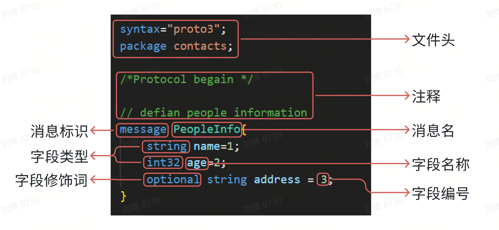

* 👋 Hi, I’m liubo
* 👀 I’m interested in harmony
* 🌱 I’m currently learning harmony
* 💞️ I’m looking to collaborate on ...
* 📫 How to reach me ...
* 📇 sssssdsdsdsdsdsdasd
* 🎃 dsdsdsdsdsddfsgdgasd
* 🍺 jyukyuiyuiyuigkasd
* 🍥 fsdfgdsgsdgdgadsa
* ✨ xcvxcvxcvxcvdasdaasd
* 🍰 dazdsxasxsaxsaasdsa
* 🚨 gdfgdshdfhfhygjtyu


# Protobuf基本语法

Protobuf中最基本的数据单元是message。在每一个message中都会有一个或者多个字段(field)，在message中承载的数据分别对应一个字段，message中可以嵌套message或其它的基础数据类型的成员。





## 消息格式


message格式：

message MessageName {
    role type name = tag [default value]
    字段规则 类型 名称 = 字段编号
}


如下为一个简单的proto文件

```protobuf
syntax = "proto3";
package protobuf.addressbook;

message SearchRequest {
  singular string query = 1;
  int32 page_number = 2;
  int32 results_per_page = 3;
  
}
```

- syntax：文件第一行的syntax字段标识使用的protobuf是哪个版本，示例表示指定本文件使用proto3语法。如果省略，protobuf编译器默认使用proto2语法。它必须是文件中非空非注释行的第一行。
- package：标识生成目标文件的包名。在C++中表示的是命名空间。示例表示生成的类和函数在protobuf命名空间的addressbook命令空间下。
- message：标识一条消息。会在目标文件中自动生成一个类。
- SearchRequest：消息名，使用首字母大写作为消息名，例如SearchRequest。
- singular：字段修饰词，指定字段规则
- string、int32：字段类型
- query、page_number、results_per_page：字段名称，字段名称使用下划线分隔名称，例如song_name。
- 1、2、3：字段编号，Protobuf编码是通过成员的唯一编号来绑定对应的数据，因此Protobuf编码后数据的体积会比较小，能够快速传输，缺点是不利于阅读


# 六、总结

以上就是今天要讲的内容，本文仅仅简单介绍了lwIP的官网主页，后续会有更多内容。


# 七、参考资料

版权声明：本文参考了其他资料和CSDN博主的文章，遵循CC 4.0 BY-SA版权协议，现附上原文出处链接及本声明。
一、 http
二、 htt
三、 LwI


---
---
---
---
---
---
---
---
---
---
---
---
---
---
---
---
---
---
---
---

