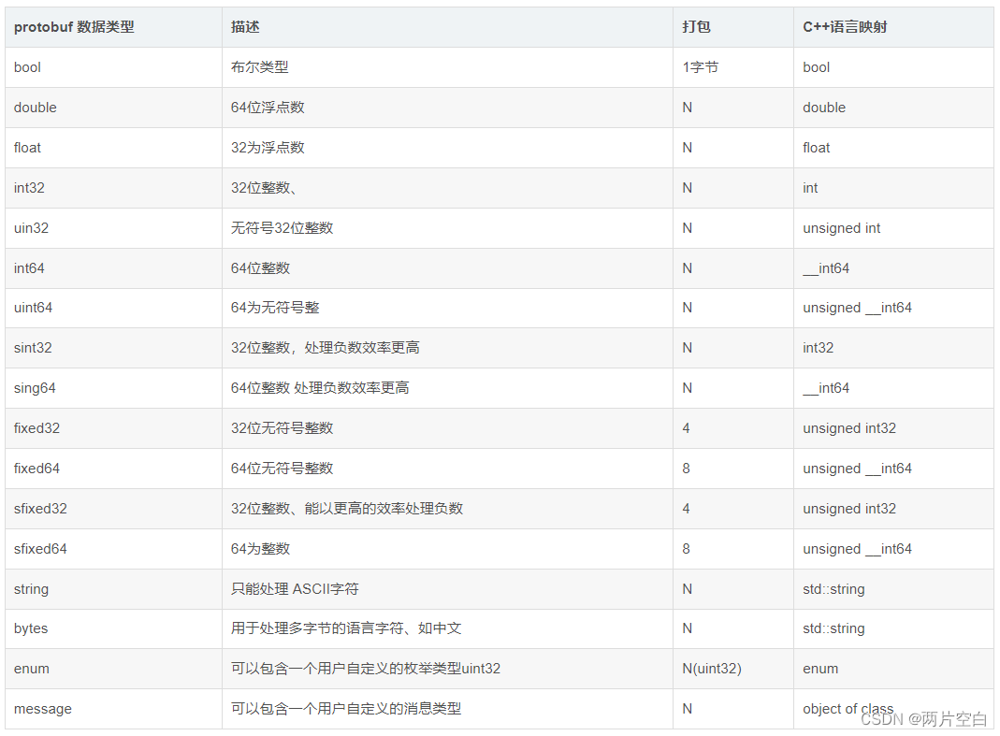

* 👋 Hi, I’m liubo
* 👀 I’m interested in harmony
* 🌱 I’m currently learning harmony
* 💞️ I’m looking to collaborate on ...
* 📫 How to reach me ...
* 📇 sssssdsdsdsdsdsdasd
* 🎃 dsdsdsdsdsddfsgdgasd
* 🍺 jyukyuiyuiyuigkasd
* 🍥 fsdfgdsgsdgdgadsa
* ✨ xcvxcvxcvxcvdasdaasd
* 🍰 dazdsxasxsaxsaasdsa
* 🚨 gdfgdshdfhfhygjtyu

# Protobuf字段

## 一、字段修饰词

字段修饰词即消息格式里的role,取值如下：

- optional：表示该字段可以有两种状态。
  - 该字段被设置，包含一个可以清晰准确的从二进制格式解析得到的值，会被序列化。
  - 该字段没有被设置，会返回一个默认值，不会被序列化。也可以自定义默认值。如果没有自定义默认值，会用系统默认值。
- singular：消息中可以包含该字段零次或⼀次（不超过⼀次）。
- required：该字段必须给值，不能为空。否则message被认为是未初始化的。如果试图建立一个未初始化的message将会抛出RuntimeException异常，解析未初始化的message会抛出IOException异常。 (仅适用proto2)
- repeated：表示该字段可以重复，可等同于动态数组，重复值的顺序将被保留。
- reserved：保留字段，为了避免再次使用到已移除的字段可以设定保留字段，当这个字段标识符被重新使用的时候，编译器会报错，不能在同一reserved语句中混合字段名称和字段编号。
- map:这是一个键值对字段类型。
- 如果未应用显式字段标签，则假定为默认字段标签，称为“隐式字段存在”。类似optional

注意：required字段是永久性的，如果之后不使用该字段，或者该字段标识改为optional或repeated，那么使用就接口读取新协议时，如果发现没有该字段，会认为该消息不完整，会拒收或者丢弃该消息。

## 二、字段类型

字段类型消息格式里的type

### 对应关系

下图为protobuf数据类型与C++数据类型的对应关系。

N 表示打包的字节并不是固定。而是根据数据的大小或者长度。例如int32，如果数值比较小，在0~127时，使用一个字节打包。

关于枚举的打包方式和uint32相同。

关于 fixed32  和int32的区别。fixed32的打包效率比int32的效率高，但是使用的空间一般比int32多。因此一个属于时间效率高，一个属于空间效率高。根据项目的实际情况，一般选择fixed32，如果遇到对传输数据量要求比较苛刻的环境，可以选择int32.

## 三、字段默认值

当解析 message 时，如果被编码的message里没有包含某些变量，那么根据类型不同，他们会有不同的默认值：

- string：默认是空的字符串
- byte：默认是空的bytes
- bool：默认为false
- numeric：默认为0
- enums：定义在第一位的枚举值，也就是0
- messages：根据生成的不同语言有不同的表现

收到数据反序列化后，对于标准值类型的数据，比如bool，如果它的值是false，那么我们无法判断这个值是对方设置的，还是对方压根就没给这个变量设置值。

## 四、字段编号

消息定义中每个字段都有一个唯一的编号，它是字段标识，在每一个消息中是独一无二的。实际上，在编码后传递消息传递的是这个编号而不是字段名。

字段编号必须符合这些规则：

- 在当前消息中每个字段的编号必须唯一，字段编号不能重复使用。
- 编号范围为1～536870911。
- 字段编号19000~19999 是 protobuf 预留的，用户不能使用。
- 不能使用之前保留的字段编号和分配给扩展字段的字段编号。

字段编号用于以二进制格式标识字段，一旦消息类型被使用，就不应该被更改。“更改”字段编号相当于删除该字段并创建一个具有相同类型但具有新编号的新字段。

虽然编号的定义范围比较大，但不同编号也会对protobuf编码带来一些影响：

- 1 ~ 15：单字节编码
- 16 ~ 2047：双字节编码

使用频率高的字段编号最好设置在1~15范围，这个范围的字段编号转变为二进制格式后占用空间更小，仅占一个字节，在16 ~ 2047范围的字段编号要占两个字节。但由于编号一旦指定不能修改，所以为了以后扩展，也记得为未来保留一些1~15的编号。

## 五、总结

以上就是今天要讲的内容，本文仅仅简单介绍了lwIP的官网主页，后续会有更多内容。

## 六、参考资料

版权声明：本文参考了其他资料和CSDN博主的文章，遵循CC 4.0 BY-SA版权协议，现附上原文出处链接及本声明。
一、 ht
二、 ht
三、 Lw

---
---
---
---
---
---
---
---
---
---
---
---
---
---
---
---
---
---
---
---
