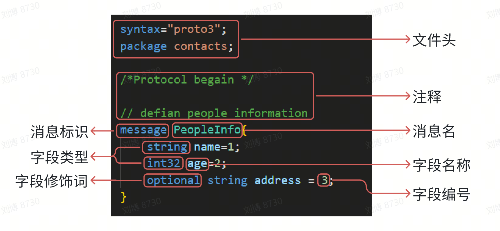

* 👋 Hi, I’m liubo
* 👀 I’m interested in harmony
* 🌱 I’m currently learning harmony
* 💞️ I’m looking to collaborate on ...
* 📫 How to reach me ...
* 📇 sssssdsdsdsdsdsdasd
* 🎃 dsdsdsdsdsddfsgdgasd
* 🍺 jyukyuiyuiyuigkasd
* 🍥 fsdfgdsgsdgdgadsa
* ✨ xcvxcvxcvxcvdasdaasd
* 🍰 dazdsxasxsaxsaasdsa
* 🚨 gdfgdshdfhfhygjtyu


# Protobuf基本语法

Protobuf中最基本的数据单元是message。在每一个message中都会有一个或者多个字段(field)，在message中承载的数据分别对应一个字段，message中可以嵌套message或其它的基础数据类型的成员。





## 一、消息格式


message格式：

message MessageName {
    role type name = tag [default value]
    字段规则 类型 名称 = 字段编号
}


如下为一个简单的proto文件

```protobuf
syntax = "proto3";
package protobuf.addressbook;

message SearchRequest {
  singular string query = 1;
  int32 page_number = 2;
  int32 results_per_page = 3;
  
}
```

- syntax：文件第一行的syntax字段标识使用的protobuf是哪个版本，示例表示指定本文件使用proto3语法。如果省略，protobuf编译器默认使用proto2语法。它必须是文件中非空非注释行的第一行。
- package：标识生成目标文件的包名。在C++中表示的是命名空间。示例表示生成的类和函数在protobuf命名空间的addressbook命令空间下。
- message：标识一条消息。会在目标文件中自动生成一个类。
- SearchRequest：消息名，使用首字母大写作为消息名，例如SearchRequest。
- singular：字段修饰词，指定字段规则
- string、int32：字段类型
- query、page_number、results_per_page：字段名称，字段名称使用下划线分隔名称，例如song_name。
- 1、2、3：字段编号，Protobuf编码是通过成员的唯一编号来绑定对应的数据，因此Protobuf编码后数据的体积会比较小，能够快速传输，缺点是不利于阅读


## 二、添加注释

proto 添加注释,使用 C/C++风格的 // 或者 /* … */ 语法.

## 三、服务

如果要在RPC（Remote Procedure Call，远程过程调用）系统中使用消息类型，可以在.proto文件中定义RPC服务接口，协议缓冲区编译器将根据所选语言生成服务接口代码和存根。

```protobuf
service FooService {
  rpc GetSomething(FooRequest) returns (FooResponse);
}
```

更新消息类型

如果现有的消息类型不满足你的所有需求——例如，你希望消息格式有一个额外的字段——但是你仍然希望使用用旧格式创建的代码，别担心！在不破坏任何现有代码的情况下更新消息类型非常简单。请记住以下规则:

- 不要更改任何现有字段的字段编号。
- 如果您添加新字段，则使用“旧”消息格式的代码序列化的任何消息仍然可以由新生成的代码解析。您应该记住这些元素的默认值，以便新代码可以正确地与旧代码生成的消息交互。类似地，新代码创建的消息可以由旧代码解析：旧二进制文件在解析时会忽略新字段。有关详细信息，请参阅未知字段部分。
- 只要在更新的消息类型中不再使用字段编号，就可以删除字段。您可能想要重命名该字段，可能添加前缀“OBSOLETE_”，或将字段编号设为保留，以便您的未来用户.proto不会意外重用该编号。
- int32、uint32、int64、uint64和bool都是兼容的——这意味着您可以将字段从其中一种类型更改为另一种类型，而不会破坏向前或向后兼容性。如果从不适合相应类型的线路中解析出一个数字，您将获得与在 C++ 中将该数字强制转换为该类型相同的效果（例如，如果将 64 位数字读取为int32，它将被截断为 32 位）。
- sint32并且sint64彼此兼容，但与其他整数类型不兼容。
- 只要字节是有效的UTF - 8，string和bytes就兼容
- fixed32与sfixed32兼容， fixed64与sfixed64兼容。
- …

# 四、总结

以上就是今天要讲的内容，本文仅仅简单介绍了lwIP的官网主页，后续会有更多内容。

# 五、参考资料

版权声明：本文参考了其他资料和CSDN博主的文章，遵循CC 4.0 BY-SA版权协议，现附上原文出处链接及本声明。
一、 http
二、 htt
三、 LwI


---
---
---
---
---
---
---
---
---
---
---
---
---
---
---
---
---
---
---
---

