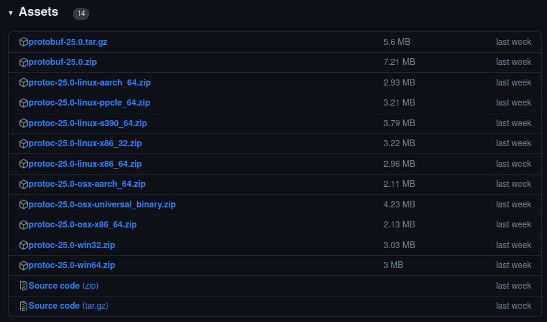

* 👋 Hi, I’m liubo
* 👀 I’m interested in harmony
* 🌱 I’m currently learning harmony
* 💞️ I’m looking to collaborate on ...
* 📫 How to reach me ...


# Protocol编译

protobuf的核心是一个后缀名为.proto文件，在proto文件中我们自定义数据结构，然后通过使用protobuf编译工具protoc编译，通过这个编译工具，我们可以把.proto文件生成go, Java, Python, C++, Ruby或者C#代码，

对于C++生成".pb.cc"和".pb.h"两个文件。

## protoc安装

### 命令行方式

linux版本

```shell
sudo apt update
sudo apt upgrade
sudo apt install libprotobuf-dev protobuf-compiler  
```


### 安装包方式

下载地址： https://github.com/protocolbuffers/ProtoBuf/releases

下载界面





linux版本

protoc-25.0-linux-x86_64.zip

windows版本

protoc-25.0-win64.zip


不需要编译，只需将下载得到的可执行文件protoc所在的bin目录加到电脑本地环境变量中。

```shell
protoc --version          //查看版本，判断是否安装成功
libprotoc 3.12.4
```


## 编译命令

使用以下命令来编译.proto文件

```shell
protoc  --cpp_out=./  --cpp_opt=paths=source_relative  path/*.proto
```

命令将当前目录中的所有.proto文件进行编译并生成C++代码。

编译器会为每个.proto文件创建一个源文件。

输出的文件名是把protobuf文件的扩展名.proto替换为.pb.c或.pb.h。

使用*.proto，必须标明路径。


### --proto_path 参数

--proto_path=IMPORT_PATH

- IMPORT_PATH是被编译的.proto文件所在的目录。
- 如果省略则在当前目录搜索。
- 如果有多个目录则可以多次调用--proto_path，它们将会顺序的被访问并执行导入。
- 可简写成 -IIMPORT_PATH。


### --cpp_out 参数

--cpp_out=DST_DIR

- 编译生成C++代码。
- DST_DIR编译后生成的文件存放目录。
- DST_DIR必须存在。
- 如果需要，编译器会自动创建嵌套的输出子目录，但不会创建输出目录本身。
- --java_out=DST_DIR 编译生成java代码
- --python_out=DST_DIR 编译生成python代码


### 使用示例

```shell
#!/bin/sh

# file name:complile.sh
# author:liubo
# data:2023.12.21

echo "---------------protoc begain compile---------------"

mkdir -p ../build/proto

# 定义变量
PROTOBUF_PATH=~/00-liubo/project_my/Protobuf_tutorial/protobuf/bin
option=--experimental_allow_proto3_optional // 使用optional类型需要此选项

# 注意路径，在build目录下执行，这里的路径以build为当前路径
# -I 同义于 --proto_path=
# 源文件路径   ../proto
# 目标文件路径 ../build/proto
$PROTOBUF_PATH/protoc $option -I../proto --cpp_out=../build/proto ../proto/*.proto

```


---

---

---

---

---

---

---

---

---

---

---

---

---

---

---

---

---

---

---

---